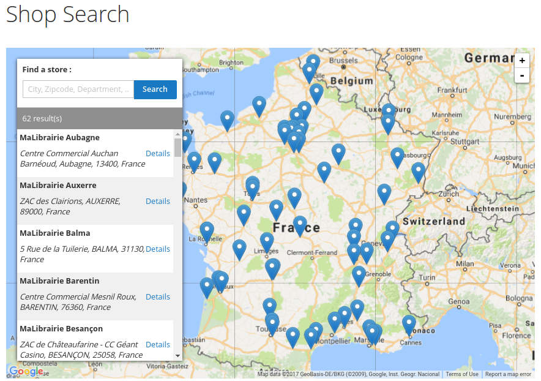
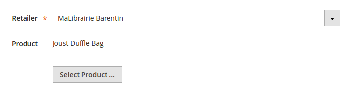
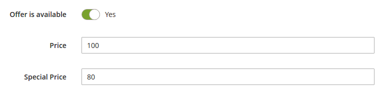
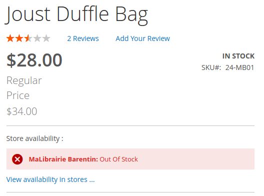
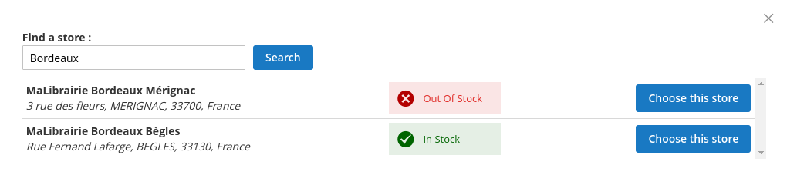
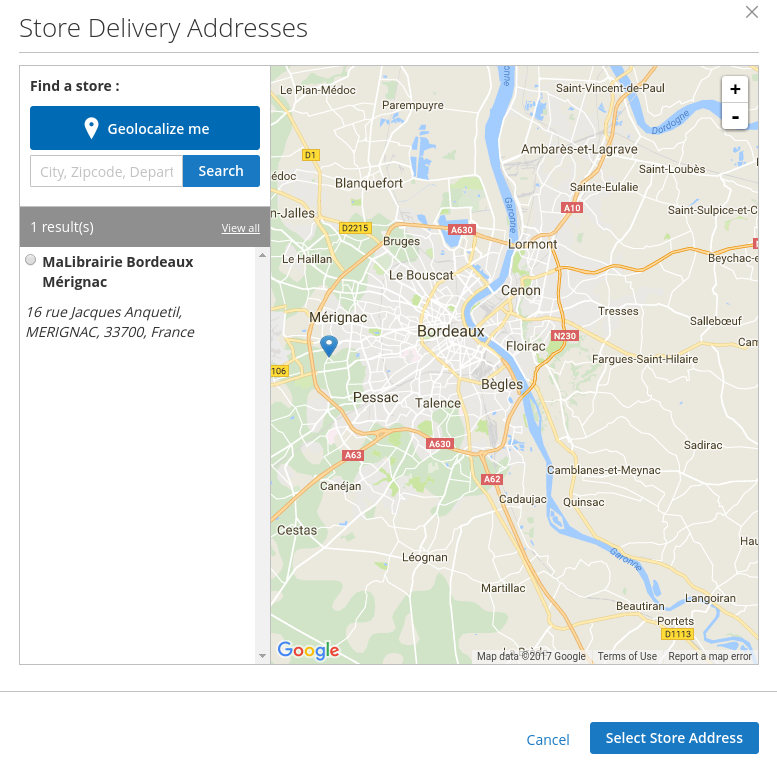

## News

### Compatibility

Due to all new paradigms introduced by Magento 2.1 (entity manager, forms based on UI components, staging for the EE edition, ...), the **required minimum version of Magento for using this module is Magento 2.1**

If your project is based on Magento 2.1.x you can start working with ElasticSuite for Retailer today using the latest **1.2.0-alpha1 release**.

### Requirements

The module requires :

- [ElasticSuite](https://github.com/Smile-SA/elasticsuite) > 2.3.3*
- [Offer](https://github.com/Smile-SA/magento2-module-offer) > 1.3.*
- [Seller](https://github.com/Smile-SA/magento2-module-seller) > 1.2.*
- [Retailer](https://github.com/Smile-SA/magento2-module-retailer) > 1.2.*
- [Store Locator](https://github.com/Smile-SA/magento2-module-store-locator) > 1.3.*
- [Retailer Offer](https://github.com/Smile-SA/magento2-module-retailer-offer) > 1.3.*
- [Store Delivery](https://github.com/Smile-SA/magento2-module-store-delivery) > 1.1.*

### How to use

1. Install the module via Composer :

``` composer require smile/elasticsuite-for-retailer ```

2. Enable it

``` bin/magento module:enable Smile_Offer ```

``` bin/magento module:enable Smile_Seller ```

``` bin/magento module:enable Smile_Retailer ```

``` bin/magento module:enable Smile_StoreLocator ```

``` bin/magento module:enable Smile_RetailerOffer ```

``` bin/magento module:enable Smile_StoreDelivery ```

3. Install the module and rebuild the DI cache

``` bin/magento setup:upgrade ```


## What is ElasticSuite for Retailers ?

This package is a suite of several modules aiming to help merchants dealing with retail and omnichannel mechanics in Magento 2 (Store Locator, Product availability/price per store, pickup in store, etc...).

The package relies on our custom Search and Merchandising tool called ElasticSuite which can be found [here](https://github.com/Smile-SA/elasticsuite).

For more information, read <strong>the User Guide "Smile ElasticSuite for retailer"</strong>. It's available [here](https://github.com/vipra93/elasticsuite-for-retailer/blob/master/doc/static/User%20Guide%20Smile%20ElasticSuite%20for%20Retailer%20Magento%202%20v1.pdf).

## Who is developping ElasticSuite for Retailer ?

<p align="center">
    <a href="http://www.smile-oss.com"></a>
</p>

SmileLab is the innovation and experimentation department of Smile. Smile is the **European leader of Open Source** and also a four-times **Europe Partner of the the Year** (2010-2014) and two-times **Spirit of Excellence** (2015-2016) awarded by Magento.

Our multidisciplinary team brings together experts in technology, innovation, and new applications.

Together we explore, invent, and test technologies of the future, to better serve our clients.

## Main Features

### Current version

The current **1.4.2** version has been focused on two main features :

<br/>

* **Store Locator :**

    This feature allows you to **create and manage your shops** in Magento's back-office. The module comes by default with several pre-configured attributes such as Shop Address, GPS coordinates, Opening Hours, etc...

    Once you have created all your shops, your customers will be able to navigate through them in the Front-Office on a **map**.



Each of your stores has also a **Shop detail page** and eventually a **Contact Shop page** if you enable this option on the store.

Your customer will be able to choose his favorite shop and this will keep it during all his navigation through your website.

<br/>

* **Store Offers :**

    This features let you create **specific offers for a given product and a given shop** : you'll be able to define the price and/or the availability for a product in each shop.

<p align="center">
    
    
</p>

   You will be able to enable an option to filter the navigation of the customer to the products available in his favorite shop :

<p align="center">
    
</p>

<br/>

The customer will even have the possibility to see **product's availability in the other shops** on the product detail page :

<p align="center">
    
</p>

* **In Store delivery :**

    This feature allow the customer to choose between stores for the shipping address of his order.

<p align="center">
    
</p>

This is handled during checkout via a Store chooser in a popin.


<p align="center">
    
</p>

### And more to come !

The next versions that will be coming will include the following features :

* **Shops in autocomplete :**

    We plan to add the shops to the autocomplete box results for faster access.

* **And many more !**

    We will announce and integrate more features to the roadmap soon.

## Documentation

Documentation is available [here](https://github.com/Smile-SA/elasticsuite-for-retailer/wiki).

